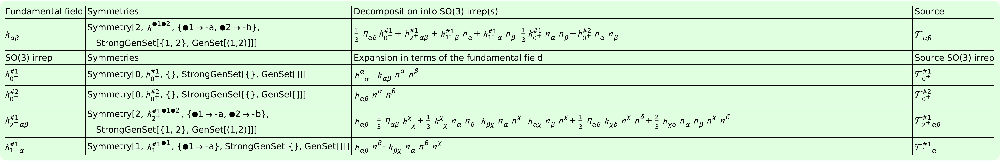
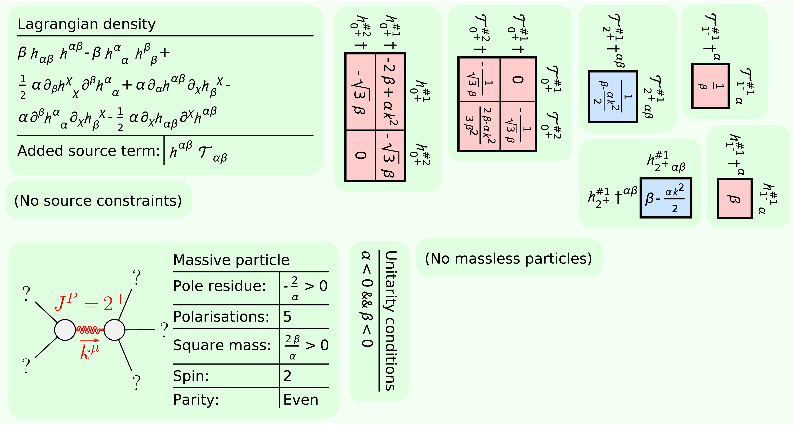

[](https://arxiv.org/abs/2311.11790)
[](https://arxiv.org/abs/2402.07641)
[](https://arxiv.org/abs/2402.14917)
[](https://arxiv.org/abs/2406.09500)


# _PSALTer_: Particle Spectrum for Any Tensor Lagrangian
## Version 1.0.0

- Initial release to accompany pre-print and documentation.

## License

Copyright © 2022 Will Barker, Carlo Marzo and Claire Rigouzzo.

_PSALTer_ is distributed as free software under the [GNU General Public License (GPL)](https://www.gnu.org/licenses/gpl-3.0.en.html).

_PSALTer_ is provided without warranty, or the implied warranty of merchantibility or fitness for a particular purpose.

## About

_PSALTer_ is a software package for _Mathematica_ designed to predict the propagating quantum particle states in any tensorial field theory, including (but not limited to) just about any theory of gravity. The free action $S_{\text{F}}$ must have the structure
```math
S_{\text{F}}=\int\mathrm{d}^4x\ \zeta(x)^{\text{T}}\cdot\Big[\mathcal{O}(\partial)\cdot\zeta(x)-j(x)\Big],
```
where the ingredients are:
- The dynamical fields $\zeta(x)$ are real tensors, which may be a collection of distinct fields, each field having some collection of spacetime indices ($\mu$, $\nu$, etc.), perhaps with some symmetry among the indices. 
- The wave operator $\mathcal{O}(\partial)$ is a real, second-order (Ostrogradsky's theorem discourages higher-derivative operators, but even if it did not we note that the apparent order may always be lowered by the introduction of extra fields) differential operator constructed from the flat-space metric $\eta_{\mu\nu}$ and partial derivative $\partial_\mu$ (but _not_ the totally antisymmetric $\epsilon^{\mu\nu\sigma\lambda}$ tensor), linearly parameterised by a collection of coupling coefficients.
- The source currents $j(x)$ are conjugate to the fields $\zeta(x)$. They encode all external interactions to second order in fields, whilst keeping the external dynamics completely anonymous.

## Example: massive gravity 

As a demonstration, we consider the Fierz-Pauli linearised massive gravity theory
```math
S=\int\mathrm{d}^4x\ \Big[\alpha\big(-\partial^\mu h_{\mu\nu}\partial^nu h+\tfrac{1}{2}\partial_\mu h\partial^\mu h-\tfrac{1}{2}\partial_\sigma h^{\mu\nu}\partial_\sigma h_{\mu\nu}+\partial_\nu h^{\mu\nu}\partial^\sigma h_{\mu\sigma}\big)+\beta\big(h^{\mu\nu}h_{\mu\nu}-h^2\big)+h^{\mu\nu}T_{\mu\nu}\Big],
```
where $\alpha$ and $\beta$ are coupling coefficients, $h_{\mu\nu}$ is the metric perturbation and $T^{\mu\nu}$ is the linearised stress-energy tensor of matter, which is the source conjugate to $h_{\mu\nu}$.

In a fresh notebook we first load the package:
```
<<xAct`PSALTer`;
```
Next, we define Lagrangian couplings $\alpha$ and $\beta$ as `Coupling1` and `Coupling2` using the command `DefConstantSymbol` from _xAct_:
```mathematica
DefConstantSymbol[Coupling1,PrintAs->"\[Alpha]"];
DefConstantSymbol[Coupling2,PrintAs->"\[Beta]"];
```
Next, we use the command `DefField` from _PSALTer_ to define the metric perturbation $h_{\mu\nu}$ as the symmetric, rank-two tensor field `MetricPerturbation`:
```mathematica
DefField[
    MetricPerturbation[-a,-b],
    Symmetric[{-a,-b}],
    PrintAs->"\[ScriptH]",
    PrintSourceAs->"\[ScriptCapitalT]"
];
```
The output should look like:



To compute the spectrum, we plug the Lagrangian into the `ParticleSpectrum` function from _PSALTer_:
```mathematica
ParticleSpectrum[
    Coupling1*(
	(1/2)*CD[-b]@MetricPerturbation[a,-a]*CD[b]@MetricPerturbation[c,-c]
	-CD[a]@MetricPerturbation[-a,-b]*CD[b]@MetricPerturbation[c,-c]
	-(1/2)*CD[-c]@MetricPerturbation[a,b]*CD[c]@MetricPerturbation[-a,-b]
	+CD[-b]@MetricPerturbation[a,b]*CD[c]@MetricPerturbation[-a,-c]
    )
    +Coupling2*(
        MetricPerturbation[-a,-b]*MetricPerturbation[a,b]
        -MetricPerturbation[a,-a]*MetricPerturbation[b,-b]
    ),
    TheoryName->"MassiveGravity",	
    Method->"Easy",
    MaxLaurentDepth->3
];
```
The output should look like:



## Documentation 

The documentation notebook is at `PSALTer/xAct/PSALTer/Documentation/English/Documentation.nb`. It is recommended to also read [the paper](https://arxiv.org/abs/2406.09500).

## General use 

### Pre-defined geometry

When you first run `` <<xAct`PSALTer` `` the software defines a Minkowski manifold with the ingredients:

|Wolfram Language|Output format|Meaning|
|---|---|---|
|`a`, `b`, `c`, ..., `z`|$\alpha$, $\beta$, $\gamma$, ... $\zeta$|Cartesian coordinate indices|
|`G[-m,-n]`|$\eta_{\mu\nu}$|Minkowski metric|
|`CD[-m]@`|$\partial_{\mu}$|Partial derivative|

### Provided functions 

_PSALTer_ defines _two_ functions. To define a tensor field you use `DefField`, which has a very similar syntax to `DefTensor` in _xTensor_:
```mathematica
DefField[
    FieldNameValue_[IndsValue___],
    SymmValue_,
    PrintAs->PrintAsValue_,
    PrintSourceAs->PrintSourceAsValue_
];
```
The arguments and options are as follows:
- `FieldNameValue` is the symbolic name of the new field.
- `IndsValue` are the indices of `FieldNameValue`, if any.
- `SymmValue` is the intended index-symmetry on `IndsValue`. The syntax is the same as in `DefTensor`.
- `PrintAsValue` is the string that `FieldNameValue` will use as format. The syntax is the same as in `DefTensor`.
- `PrintSourceAsValue` is the string that the source conjugate to `FieldNameValue` will use as format.

To compute a spectrum, use `ParticleSpectrum`:
```mathematica
ParticleSpectrum[
    LagrangianValue_,
    TheoryName->TheoryNameValue_,
    Method->MethodValue_,
    MaxLaurentDepth->MaxLaurentDepthValue_
];
```
The arguments and options are as follows:
- `LagrangianValue` must be a valid linearised Lagrangian density. The expression must be a Lorentz-scalar. Each term must be quadratic in the field(s) `FieldNameValue` defined using `DefField`. Each term must be linear in coupling constants defined using `DefConstantSymbol` from _xTensor_. Other allowed ingredients are `CD` acting on field(s) `FieldNameValue` and `G` used to contract indices. Do _not_ use an odd power of `epsilonG`, which will result in a parity-odd theory. Do _not_ include the term coupling the fields to their conjugate sources: this is automatically included.
- `TheoryNameValue` can be any string. This is used for labelling the output files.
- `MethodValue` can be either of the strings `"Easy"` (default) or `"Hard"` (experimental, uses home-brewed implementations of the symbolic Moore-Penrose inverse and other innovations).
- `MaxLaurentDepthValue` can be `1`, `2` or `3`. This sets the maximum positive integer $n$ for which the $1/k^{2n}$ null pole residues are requested. The default is `1`, from which the massless spectrum can be obtained. Setting higher $n$ naturally leads to longer wallclock times, but also allows potential (pathological) higher-order/non-simple propagator poles to be identified, down to the requested depth.

## Quickstart 

### Requirements 

#### Basic hardware requirements

- A multi-core processor (recommended, note that most modern PCs are multi-core)
- An internet connection (recommended for _PSALTer_ to interrogate the [Wolfram Function Repository](https://resources.wolframcloud.com/FunctionRepository))

#### Operating systems

- [_Linux_](https://www.linux.org/) (recommended, tested on _Linux v 6.9.1_ via [_Manjaro_](https://manjaro.org/), [_Arch_](https://archlinux.org/), [_RockyLinux 8 (RHEL8)_](https://rockylinux.org/) and [_CentOS7 (RHEL7)_](https://www.centos.org/))
- [_macOS_](https://www.apple.com/uk/macos) (not recommended, tested on _macOS Monterey_)
- [_Windows_](https://www.microsoft.com/en-gb/windows?r=1) (not recommended, tested on _Windows 10_)

#### Software dependencies

- [_Mathematica_](https://www.wolfram.com/mathematica/) (required, tested on _Mathematica v 14.0.0.0_)
- [_xAct_](http://www.xact.es/) (required packages [_xTensor_](http://www.xact.es/xCoba/index.html), [_SymManipulator_](http://www.xact.es/SymManipulator/index.html), [_xPerm_](http://www.xact.es/xPerm/index.html), [_xCore_](http://www.xact.es/xCore/index.html), [_xTras_](http://www.xact.es/xTras/index.html) and [_xCoba_](http://www.xact.es/xCoba/index.html), tested on _xAct v 1.2.0_)
- [_RectanglePacking_](https://resources.wolframcloud.com/PacletRepository/resources/JasonB/RectanglePacking/) (recommended, tested on _RectanglePacking v 1.0.0_)
- [_Inkscape_](https://inkscape.org/) (recommended for _Linux_ and _macOS_ only, tested on _Inkscape v 1.3.2_)

### Installation

#### _Linux_

1. ***Prepare.*** Make sure your system satisfies all the [requirements](#requirements).
2. ***Download.*** You can download the latest release from the panel on the right, and unzip using:
```console, bash
[user@system ~]$ unzip ~/Downloads/PSALTer*
[user@system ~]$ mv ~/PSALTer* ~/PSALTer
```
Alternatively, if you have _git_ installed, the following _bash_ command will download _PSALTer_ into the home directory:
```console, bash, git
[user@system ~]$ git clone https://github.com/wevbarker/PSALTer
```

3. ***Install.*** To perform the installation, the sources need only be copied to the location of the other _xAct_ sources. For a global installation of _xAct_ this may require:
```console, bash
[user@system ~]$ cd PSALTer/xAct
[user@system xAct]$ sudo cp -r PSALTer /usr/share/Mathematica/Applications/xAct/
```
For a local installation of _xAct_, the path may be vary:
```console, bash
[user@system xAct]$ cp -r PSALTer ~/.Mathematica/Applications/xAct/
```

#### _macOS_

1. ***Prepare.*** Make sure your system satisfies all the [requirements](#requirements).
2. ***Download.*** You can download the latest release from the panel on the right, and unzip using:
```console, zsh 
user@system ~ % unzip ~/Downloads/PSALTer*
user@system ~ % mv ~/PSALTer* ~/PSALTer
```
Alternatively, if you have _git_ installed, the following _zsh_ command will download _PSALTer_ into the home directory:
```console, zsh, git
user@system ~ % git clone https://github.com/wevbarker/PSALTer
```

3. ***Install.*** To perform the installation, the sources need only be copied to the location of the other _xAct_ sources. For a global installation of _xAct_ this may require:
```console, zsh 
user@system ~ % cd PSALTer/xAct
user@system xAct % sudo cp -r PSALTer /Library/Mathematica/Applications/xAct/
```
For a local installation of _xAct_, the path may be vary:
```console, zsh 
user@system xAct % cp -r PSALTer ~/Library/Mathematica/Applications/xAct/
```
4. Make sure you've read the [known bugs](#known-bugs) that can affect _macOS_ users.

#### _Microsoft Windows_

1. ***Prepare.*** Make sure your system satisfies all the [requirements](#requirements).
2. ***Download.*** You can download the latest release from the panel on the right, and unzip in _File Explorer_ using _right-click_ and _Extract All_. Alternatively, if you have _git_ installed, the following _cmd_ command will download _PSALTer_ into the home directory:
```console, cmd, git
C:\Users\user> git clone https://github.com/wevbarker/PSALTer
```
3. ***Install.*** To perform the installation, the sources need only be copied to the location of the other _xAct_ sources. For a global installation of _xAct_, you may need to open _File Explorer_ using _right-click_ and _Run as administrator_. Alternatively, use the following _cmd_ commands (again, opening _cmd_ using _Run as administrator_): 
```console, cmd
C:\Users\user> cd PSALTer
C:\Users\user\PSALTer> xcopy /e /k /h /i xAct\ "C:\Program Files\Wolfram Research\Mathematica\14.0\AddOns\Applications\xAct\"
```
For a local installation of _xAct_, the path may be vary:
```console, cmd 
C:\Users\user\PSALTer> xcopy /e /k /h /i xAct\ "C:\Users\user\AppData\Roaming\Mathematica\Applications\xAct\"
```
4. Make sure you've read the [known bugs](#known-bugs) that can affect _Microsoft Windows_ users.

## Known bugs 

Currently, all the known bugs affect just the production of the final output graphic and PDF file. The process of producing a vectorised, publication-grade graphic is convoluted; information boxes have to be exported as temporary PDF files, converted to EPS files using _Inkscape_ (not on _Microsoft Windows_), and re-imported as vector graphics to be rectangle-packed and re-exported again. Currently, this is a process which works well only on _Linux_.

:warning: **If you just want to get the science results, without the PDF, you should run in your notebook the line `` xAct`PSALTer`Private`$NoExport=True `` before using `DefField` or `ParticleSpectrum`. This is a temporary fix, and will result in a less compact form of final output graphic that is not exported to a PDF. You can still try to export this graphic manually using the drop-down menus.**

If you decide to continue with the default behaviour, you may encounter the following errors:
1. A reliable error on _macOS_ generating the messages `RunProcess::pnfd` and `Import::fmterr`. As suggested by the messages, check `Environment["PATH"]` in your notebook. The result should include the path of the directory containing the _Inkscape_ binary on your system. You can find out where that binary is located using `which inkscape` in _zsh_, and amend the path accordingly in the notebook using `SetEnvironment`.
2. A sporadic error on all operating systems generating the messages `Transpose::nmtx`, `FindPermutation::norel`, `MapThread::mptd`, `Part::partw`. The cause of this is not clear.
3. A reliable error on _macOS_ and _Microsoft Windows_ involving more-or-less misplaced glyphs in the output graphic. This happens when _PSALTer_ is unable to use _Inkscape_ on the system (the default case for _Microsoft Windows_), and so it defaults to re-importing the PDF graphics rather than converting to EPS. The _Mathematica_ PDF importer is well-known to have lots of problems, and so it usually corrupts the figure to some extent.
4. A sporadic error on _Linux_ and _macOS_ involving missing or incorrect glyphs in the output graphic. This seems to happen when _Inkscape_ was only partially successful. On _Linux_, the problem has to do with installed fonts, and it may be solved by upgrading your system (and rebooting).

## Contribute

Please do! I'm always responsive to emails (about science), so be sure to reach out at [wb263@cam.ac.uk](mailto:wb263@cam.ac.uk).

## Acknowledgements

This work used the DiRAC Data Intensive service (CSD3 [www.csd3.cam.ac.uk](www.csd3.cam.ac.uk)) at the University of Cambridge, managed by the University of Cambridge University Information Services on behalf of the STFC DiRAC HPC Facility ([www.dirac.ac.uk](www.dirac.ac.uk)). The DiRAC component of CSD3 at Cambridge was funded by BEIS, UKRI and STFC capital funding and STFC operations grants. DiRAC is part of the UKRI Digital Research Infrastructure.

This work also used the Newton server, access to which was provisioned by Will Handley using an ERC grant.

_PSALTer_ was improved by many useful discussions with Jaakko Annala, Stephanie Buttigieg, Will Handley, Mike Hobson, Manuel Hohmann, Damianos Iosifidis, Georgios Karananas, Anthony Lasenby, Yun-Cherng Lin, Oleg Melichev, Yusuke Mikura, Vijay Nenmeli, Roberto Percacci, Syksy Räsänen, Cillian Rew, Zhiyuan Wei, David Yallup, Haoyang Ye, and Sebastian Zell.

WB is grateful for the kind hospitality of Leiden University and the [Lorentz Institute](https://www.lorentz.leidenuniv.nl/), and the support of [Girton College, Cambridge](https://www.girton.cam.ac.uk/).
The work of CM was supported by the Estonian Research Council grants PRG1677, RVTT3, RVTT7, and the CoE program TK202 "_Fundamental Universe_".
CR  acknowledges support from a Science and Technology Facilities Council (STFC) Doctoral Training Grant.
