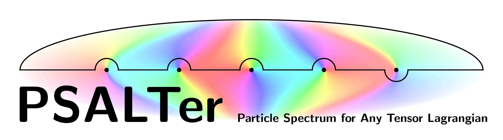
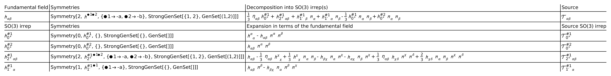
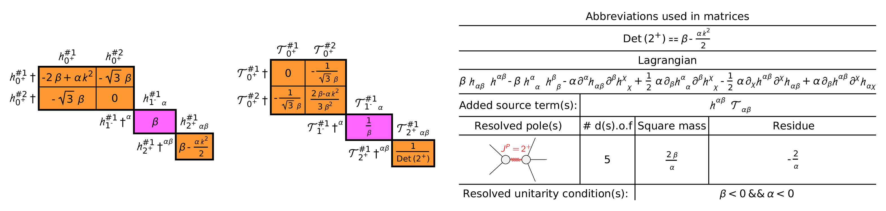

[](https://arxiv.org/abs/2311.11790)
[](https://arxiv.org/abs/2402.07641)
[](https://arxiv.org/abs/2402.14917)
[](https://arxiv.org/abs/2406.09500)
[](https://arxiv.org/abs/2406.12826)
[](https://arxiv.org/abs/2412.15329)
[](https://arxiv.org/abs/2505.23894)
[](https://arxiv.org/abs/2506.02111)



# _PSALTer_: Particle Spectrum for Any Tensor Lagrangian
## Version 2.0.1

- Removed _RectanglePacking_ from package dependencies.
- Updated `README.md`.

## License

Copyright © 2022 Will Barker, Giorgos Karananas, Carlo Marzo, Claire Rigouzzo and Haochen Tu.

_PSALTer_ is distributed as free software under the [GNU General Public License (GPL)](https://www.gnu.org/licenses/gpl-3.0.en.html).

_PSALTer_ is provided without warranty, or the implied warranty of merchantibility or fitness for a particular purpose.

If _PSALTer_ was useful to your research, please **cite us** using the following _BibTeX_:
```tex
@article{Barker:2024juc,
    author = "Barker, Will and Marzo, Carlo and Rigouzzo, Claire",
    title = "{PSALTer: Particle Spectrum for Any Tensor Lagrangian}",
    eprint = "2406.09500",
    archivePrefix = "arXiv",
    primaryClass = "hep-th",
    month = "6",
    year = "2024"
}
@article{Barker:2025qmw,
    author = "Barker, Will and Karananas, Georgios K. and Tu, Haochen",
    title = "{The particle spectra of parity-violating theories: A less radical approach and an upgrade of PSALTer}",
    eprint = "2506.02111",
    archivePrefix = "arXiv",
    primaryClass = "hep-th",
    month = "6",
    year = "2025"
}
```

## About

_PSALTer_ is a software package for _Wolfram_ (formerly _Mathematica_) designed to predict the propagating quantum particle states in any tensorial field theory, including (but not limited to) just about any theory of gravity. The free action $S_{\text{F}}$ must have the structure
```math
S_{\text{F}}=\int\mathrm{d}^4x\ \zeta(x)^{\text{T}}\cdot\Big[\mathcal{O}(\partial)\cdot\zeta(x)-j(x)\Big],
```
where the ingredients are:
- The dynamical fields $\zeta(x)$ are real tensors, which may be a collection of distinct fields, each field having some collection of spacetime indices ($\mu$, $\nu$, etc.), perhaps with some symmetry among the indices. 
- The wave operator $\mathcal{O}(\partial)$ is a real, second-order differential operator constructed from the flat-space metric $\eta_{\mu\nu}$, partial derivative $\partial_\mu$ and totally antisymmetric $\epsilon^{\mu\nu\sigma\lambda}$ tensor, linearly parameterised by a collection of coupling coefficients. Note that Ostrogradsky's theorem discourages higher-derivative operators, but even if it did not we note that the apparent order may always be lowered by the introduction of extra fields.
- The source currents $j(x)$ are conjugate to the fields $\zeta(x)$. They encode all external interactions to second order in fields, whilst keeping the external dynamics completely anonymous.

## Example: massive gravity 

As a demonstration, we consider the Fierz-Pauli linearised massive gravity theory
```math
S=\int\mathrm{d}^4x\ \Big[\alpha\big(-\partial^\mu h_{\mu\nu}\partial^\nu h+\tfrac{1}{2}\partial_\mu h\partial^\mu h-\tfrac{1}{2}\partial_\sigma h^{\mu\nu}\partial_\sigma h_{\mu\nu}+\partial_\nu h^{\mu\nu}\partial^\sigma h_{\mu\sigma}\big)+\beta\big(h^{\mu\nu}h_{\mu\nu}-h^2\big)+h^{\mu\nu}T_{\mu\nu}\Big],
```
where $\alpha$ and $\beta$ are coupling coefficients, $h_{\mu\nu}$ is the metric perturbation with trace $h\equiv h_{\mu}^{\mu}$, and $T^{\mu\nu}$ is the linearised stress-energy tensor of matter, which is the source conjugate to $h_{\mu\nu}$.

In a fresh notebook we first load the package:
```
<<xAct`PSALTer`;
```
Next, we define Lagrangian couplings $\alpha$ and $\beta$ as `Coupling1` and `Coupling2` using the command `DefConstantSymbol` from _xAct_:
```mathematica
DefConstantSymbol[Coupling1,PrintAs->"\[Alpha]"];
DefConstantSymbol[Coupling2,PrintAs->"\[Beta]"];
```
Next, we use the command `DefField` from _PSALTer_ to define the metric perturbation $h_{\mu\nu}$ as the symmetric, rank-two tensor field `MetricPerturbation`:
```mathematica
DefField[
    MetricPerturbation[-a,-b],
    Symmetric[{-a,-b}],
    PrintAs->"\[ScriptH]",
    PrintSourceAs->"\[ScriptCapitalT]"
];
```
The output should look like:



To compute the spectrum, we plug the Lagrangian into the `ParticleSpectrum` function from _PSALTer_:
```mathematica
ParticleSpectrum[
    Coupling1*(
	(1/2)*CD[-b]@MetricPerturbation[a,-a]*CD[b]@MetricPerturbation[c,-c]
	-CD[a]@MetricPerturbation[-a,-b]*CD[b]@MetricPerturbation[c,-c]
	-(1/2)*CD[-c]@MetricPerturbation[a,b]*CD[c]@MetricPerturbation[-a,-b]
	+CD[-b]@MetricPerturbation[a,b]*CD[c]@MetricPerturbation[-a,-c]
    )
    +Coupling2*(
        MetricPerturbation[-a,-b]*MetricPerturbation[a,b]
        -MetricPerturbation[a,-a]*MetricPerturbation[b,-b]
    ),
    TheoryName->"MassiveGravity",	
    MaxLaurentDepth->3
];
```
The output should look like:



## Documentation 

The package includes a notebook with the basic example above. This notebook will try to save PDF graphics files to the directory in which it is saved, so it is better not to run it from within your actual installation. For instance, to copy the file to your home directory and run it there using the front end (notebook), you can use:
```console, bash
[user@system PSALTer]$ cp xAct/PSALTer/Documentation/English/Examples.nb ~/Examples.nb
[user@system PSALTer]$ cd
[user@system English]$ wolframnb Examples.nb &
```
The theory underlying the package is developed across two papers:
- [The first paper](https://arxiv.org/abs/2406.09500) presents _PSALTer_ v 1.0.0 (basic functionality).
- [The second paper](https://arxiv.org/abs/2503.#####) presents _PSALTer_ v 2.0.0 (extension to parity violation and breaking changes).

## General use 

### Pre-defined geometry

When you first run `` <<xAct`PSALTer` `` the software defines a Minkowski manifold with the ingredients:

| _Wolfram Language_      | Output format                            | Meaning                      |
|-------------------------|------------------------------------------|------------------------------|
| `a`, `b`, `c`, ..., `z` | $\alpha$, $\beta$, $\gamma$, ... $\zeta$ | Cartesian coordinate indices |
| `G[-m,-n]`              | $\eta_{\mu\nu}$                          | Minkowski metric             |
| `CD[-m]@`               | $\partial_{\mu}$                         | Partial derivative           |
| `epsilonG[-m,-n,-s,-l]` | $\epsilon_{\mu\nu\sigma\lambda}$         | Totally antisymmetric tensor |

For those familiar with _xAct_, note that calls to `DefManifold` and `DefMetric` are made internally at this stage. The minimal workflow in _PSALTer_ is to compute spectra based on a free Lagrangian density which has already been worked out, and simply needs to be plugged into the `ParticleSpectrum` function once the relevant fields are defined using `DefField` and the relevant coupling constants are defined using `DefConstantSymbol`. A more advanced workflow uses the geometric environment of _PSALTer_ and various tools from _xAct_ to first compute the free Lagrangian density by _linearising_ some other model. In the latter case, it is important to first understand more about the geometric environment of _PSALTer_, which is established internally by the following calls:
```mathematica
DefManifold[M4,4,IndexRange[{a,z}]];
DefMetric[-1,G[-a,-c],CD,{",","\[PartialD]"},PrintAs->"\[Eta]",FlatMetric->True,SymCovDQ->True];
```
In particular, the flat metric environment can be inconvenient when the model to be linearised is gravitational in nature, relying on some curvature tensor. At the practical level, one can always obtain the correct linearisation by reinterpreting the model as a field theory on flat spacetime: this approach is guaranteed to work because particle physics is not actually sensitive to geometry per se. Alternatively, one can prepare the linearised expression in a separate _xAct_ session, taking advantage of the full geometric interpretation, and then copy the resulting _Wolfram Language_ expression directly into the _PSALTer_ session. Care must be taken in this case to ensure that the indices are correctly matched.

### Function `DefField`

```mathematica
DefField[<Fld>[]]
```
defines a scalar field `<Fld>` and exports the field kinematics to a PDF file.
```mathematica
DefField[<Fld>[<Ind1>,<Ind2>,...]]
```
defines a tensor field `<Fld>` with indices `<Ind1>`, `<Ind2>`, etc., and exports the field kinematics to a PDF file. 
```mathematica
DefField[<Fld>[<Ind1>,<Ind2>,...],<Symm>]
```
defines a tensor field `<Fld>` with indices `<Ind1>`, `<Ind2>`, etc. and symmetry `<Symm>`, and exports the field kinematics to a PDF file.

#### Details and options

- The syntax of `DefField` is almost identical to that of `DefTensor` in _xTensor_.
- Up to three comma-separated indices may be drawn from the contravariant `a`, `b`, `c`, up to `z`, the covariant `-a`, `-b`, `-c`, up to `-z`, or any admixture.
- It is strongly recommended to use clear, alphanumeric names for `<Fld>`, because the name of the field kinematics file will be `FieldKinematics<Fld>.pdf`. As explained below, the `PrintAs` option allows the user to specify the symbol used for formatting the field in the front end (notebook) and the exported PDFs.
- The symmetry `<Symm>` can be one of the following, where `<SymmInd1>`, `<SymmInd2>`, etc. are any two or three fully covariant or contravariant, comma-separated indices drawn verbatim from `<Ind1>`, `<Ind2>`, etc.:
	- `Symmetric[{<SymmInd1>,<SymInd2>,...}]` denotes symmetrized indices.
	- `Antisymmetric[{<SymmInd1>,<SymInd2>,...}]` denotes antisymmetrized indices.
- In the front end (notebook) the currently-evaluating subroutine is displayed temporarily.
- In the terminal, the currently-evaluating subroutine is sent to `STDOUT`.
- Whilst `DefField` prints a preview of the field kinematics in the front end (notebook) it always returns `Null`.
- The following options may be given:
	- `PrintAs` is the symbol that `<Fld>` will use for formatting. In the front end (notebook), symbols can be entered directly. Programmatically, the _Wolfram Language_ admits named characters such as `"\[<Name>]"`. The default is $\zeta$ or `"\[Zeta]"`.
	- `PrintSourceAs` is the symbol that the source conjugate to `<Fld>` will use for formatting. The syntax is identical to `PrintAs`. The default is $j$ or `"\[ScriptJ]"`.
	
### Function `ParticleSpectrum`

```mathematica
ParticleSpectrum[<Lagr>];
```
computes the spectrum of the Lagrangian `<Lagr>`, and exports a spectrograph to a PDF file.

#### Details and options

- The Lagrangian `<Lagr>` must be a valid, linearised Lagrangian density. The expression must be a Lorentz-scalar. Each term must be quadratic in field(s) which have already been defined using `DefField`. Each term must be linear in coupling constant(s) which have already been defined using `DefConstantSymbol` from _xTensor_. Other allowed ingredients are `CD`, `G` and `epsilonG`. Do _not_ try to include the term coupling the fields to their conjugate sources: this is accounted for internally.
- In the front end (notebook) the currently-evaluating subroutine is displayed temporarily.
- In the terminal, the currently-evaluating subroutine is sent to `STDOUT`.
- Whilst `ParticleSpectrum` prints a preview of the spectrograph in the front end (notebook) it always returns `Null`.
- The following options may be given:
	- `TheoryName` is a mandatory option and must be set to an alphanumeric string `"<ThrNme>"`. The name of the spectrograph file will be `ParticleSpectrograph<ThrNme>.pdf`.
	- `Neglect` must be a list of the form `{{<Spn1>,<Pty1>},{<Spn2>,<Pty2>},...}`, enumerating the spins and parities of the sectors which are to be neglected in the analysis, where `<Spn1>` and `<Spn2>` etc. are `0`, `1`, `2` or `3` and `<Pty1>`, `<Pty2>` etc. are `1` or `-1`. The massless spectrum will not be computed if any sectors have been neglected. The default is `{}`.
	- `MasslessSpectrum` can be `True` or `False`. If `False`, the massless spectrum is not computed. The default is `True`.
	- `MaxLaurentDepth` can be `1`, `2` or `3`. This sets the maximum positive integer $n$ for which the $1/k^{2n}$ pole residues at $k=0$ are requested. The default is `1` (quadratic), from which the massless spectrum can be obtained. Setting higher $n$ naturally leads to longer wallclock times, but also allows any pathological higher-order (quartic and hexic) poles to be identified, down to the requested depth.
	- `ShowPropagator` can be `True` or `False`. If `True`, the propagator is displayed. The default is `False`.
	- `AspectRatio` can be `Landscape` or `Portrait`. This sets the aspect ratio of the spectrograph. The default is `Landscape`.

## Quickstart 

### Requirements 

#### Basic hardware requirements

- A multi-core processor (recommended, note that most modern PCs are multi-core).
- An internet connection (recommended for _PSALTer_ to interrogate the [Wolfram Function Repository](https://resources.wolframcloud.com/FunctionRepository)).

#### Operating systems

- [_Linux_](https://www.linux.org/) (recommended, tested on _Linux v 6.9.1_ via [_Arch_](https://archlinux.org/), [_Manjaro_](https://manjaro.org/), [_RockyLinux 8 (RHEL8)_](https://rockylinux.org/), [_CentOS7 (RHEL7)_](https://www.centos.org/)) and [_Ubuntu_](https://ubuntu.com/).
- [_macOS_](https://www.apple.com/uk/macos) (not recommended, tested on _macOS Monterey_).
- [_Windows_](https://www.microsoft.com/en-gb/windows?r=1) (not recommended, tested on _Windows 10_).

#### Software dependencies

- [_Wolfram_ (formerly _Mathematica_)](https://www.wolfram.com/mathematica/) (required, tested on _Wolfram v 14.2.0.0_).
- [_xAct_](http://www.xact.es/) (required packages [_xTensor_](http://www.xact.es/xCoba/index.html), [_SymManipulator_](http://www.xact.es/SymManipulator/index.html), [_xPerm_](http://www.xact.es/xPerm/index.html), [_xCore_](http://www.xact.es/xCore/index.html), [_xTras_](http://www.xact.es/xTras/index.html) and [_xCoba_](http://www.xact.es/xCoba/index.html), tested on _xAct v 1.2.0_).

### Installation

:warning: Note that _Mathematica_ was re-branded as _Wolfram_ on July 31 2024 with the release of _Wolfram v 14.1_. You may still be able to install _PSALTer_ in older versions of _Wolfram_ (formerly _Mathematica_) by replacing `Wolfram` with `Mathematica` in the various paths below.

#### _Linux_

1. ***Prepare.*** Make sure your system satisfies all the [requirements](#requirements).
2. ***Download.*** You can download the latest release from the panel on the right, and unzip using:
```console, bash
[user@system ~]$ unzip ~/Downloads/PSALTer*
[user@system ~]$ mv ~/PSALTer* ~/PSALTer
```
Alternatively, if you have _git_ installed, the following _bash_ command will download _PSALTer_ into the home directory:
```console, bash, git
[user@system ~]$ git clone https://github.com/wevbarker/PSALTer
```

3. ***Install.*** To perform the installation, the sources need only be copied to the location of the other _xAct_ sources. For a global installation of _xAct_ this may require:
```console, bash
[user@system ~]$ cd PSALTer/xAct
[user@system xAct]$ sudo cp -r PSALTer /usr/share/Wolfram/Applications/xAct/
```
For a local installation of _xAct_, the path may be vary:
```console, bash
[user@system xAct]$ cp -r PSALTer ~/.Wolfram/Applications/xAct/
```

#### _macOS_

:warning: Note that _macOS_ is not recommended for use with _PSALTer_.

1. ***Prepare.*** Make sure your system satisfies all the [requirements](#requirements).
2. ***Download.*** You can download the latest release from the panel on the right, and unzip using:
```console, zsh 
user@system ~ % unzip ~/Downloads/PSALTer*
user@system ~ % mv ~/PSALTer* ~/PSALTer
```
Alternatively, if you have _git_ installed, the following _zsh_ command will download _PSALTer_ into the home directory:
```console, zsh, git
user@system ~ % git clone https://github.com/wevbarker/PSALTer
```

3. ***Install.*** To perform the installation, the sources need only be copied to the location of the other _xAct_ sources. For a global installation of _xAct_ this may require:
```console, zsh 
user@system ~ % cd PSALTer/xAct
user@system xAct % sudo cp -r PSALTer /Library/Mathematica/Applications/xAct/
```
For a local installation of _xAct_, the path may be vary:
```console, zsh 
user@system xAct % cp -r PSALTer ~/Library/Mathematica/Applications/xAct/
```
4. Make sure you've read the [known bugs](#known-bugs) that can affect _macOS_ users.

#### _Microsoft Windows_

:warning: Note that _Microsoft Windows_ is not recommended for use with _PSALTer_.

1. ***Prepare.*** Make sure your system satisfies all the [requirements](#requirements).
2. ***Download.*** You can download the latest release from the panel on the right, and unzip in _File Explorer_ using _right-click_ and _Extract All_. Alternatively, if you have _git_ installed, the following _cmd_ command will download _PSALTer_ into the home directory:
```console, cmd, git
C:\Users\user> git clone https://github.com/wevbarker/PSALTer
```
3. ***Install.*** To perform the installation, the sources need only be copied to the location of the other _xAct_ sources. For a global installation of _xAct_, you may need to open _File Explorer_ using _right-click_ and _Run as administrator_. Alternatively, use the following _cmd_ commands (again, opening _cmd_ using _Run as administrator_): 
```console, cmd
C:\Users\user> cd PSALTer
C:\Users\user\PSALTer> xcopy /e /k /h /i xAct\ "C:\Program Files\Wolfram Research\Mathematica\14.0\AddOns\Applications\xAct\"
```
For a local installation of _xAct_, the path may be vary:
```console, cmd 
C:\Users\user\PSALTer> xcopy /e /k /h /i xAct\ "C:\Users\user\AppData\Roaming\Mathematica\Applications\xAct\"
```
4. Make sure you've read the [known bugs](#known-bugs) that can affect _Microsoft Windows_ users.

## Getting help 

There are several ways to get help:
- The [xAct google group](https://groups.google.com/g/xAct) contains a well established, highly active and very friendly community of researchers. Feel free to start a _New conversation_ by posting a minimal working example of your code.
- For private correspondence, you can email us at [barker@fzu.cz](mailto:barker@fzu.cz).
- Alternatively you may wish to raise a [_New issue_](https://github.com/wevbarker/PSALTer/issues) on _GitHub_.

## Known bugs 

1. A sporadic error where some of the gauge symmetries are not identified. The algorithm uses numerical methods to obtain the gauge symmetries, which involve random number generation at runtime. The error can usually be fixed by re-running `ParticleSpectrum`.
2. A sporadic error on _Linux_ and _macOS_ involving missing or incorrect glyphs in the output graphic. On _Linux_, the problem has to do with installed fonts, and it may be solved by upgrading your system (and rebooting).

## Acknowledgements

_PSALTer_ was improved by many useful discussions with Jaakko Annala, Stephanie Buttigieg, Dražen Glavan, Will Handley, Mike Hobson, Manuel Hohmann, Damianos Iosifidis, Georgios Karananas, Anthony Lasenby, Yun-Cherng Lin, Oleg Melichev, Yusuke Mikura, Vijay Nenmeli, Roberto Percacci, Syksy Räsänen, Cillian Rew, Ignacy Sawicki, Zhiyuan Wei, David Yallup, Haoyang Ye, and Sebastian Zell.

This work used the DiRAC Data Intensive service (CSD3 [www.csd3.cam.ac.uk](www.csd3.cam.ac.uk)) at the University of Cambridge, managed by the University of Cambridge University Information Services on behalf of the STFC DiRAC HPC Facility ([www.dirac.ac.uk](www.dirac.ac.uk)). The DiRAC component of CSD3 at Cambridge was funded by BEIS, UKRI and STFC capital funding and STFC operations grants. DiRAC is part of the UKRI Digital Research Infrastructure.

This work also used the Newton compute server, access to which was provisioned by Will Handley using an ERC grant.

WB is grateful for the kind hospitality of Leiden University and the Lorentz Institute, and the support of Girton College, Cambridge, Marie Skłodowska-Curie Actions and the Institute of Physics of the Czech Academy of Sciences.
The work of CM was supported by the Estonian Research Council grants PRG1677, RVTT3, RVTT7, and the CoE program TK202 "_Fundamental Universe_".
CR acknowledges support from a Science and Technology Facilities Council (STFC) Doctoral Training Grant.

Co-funded by the European Union (Physics for Future – Grant Agreement No. 101081515). Views and opinions expressed are however those of the author(s) only and do not necessarily reflect those of the European Union or European Research Executive Agency. Neither the European Union nor the granting authority can be held responsible for them.
